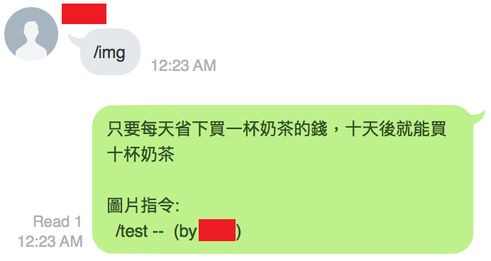

# 簡介 #
Areis Bot 是一個 LINE 客戶端，它可以讓使用者自己定義貼圖以及文字巨集。如果你願意的話，甚至可以將正版貼圖截圖下來，接著自定義貼圖，進而產生"山寨版"的貼圖。

Areis Bot 是基於 [line](https://pypi.python.org/pypi/line) 套件所建立的基本框架開發，被逆向的 LINE protocol 則來自 [curve](https://pypi.python.org/pypi/curve/)。

Areis 是一個朋友的名字，不具其他特別的意義。


# 安裝 #
```
$ sudo pip install requests line
```
會裝好所需的套件，例如：thrift, curve, rsa, ...


# 設定 #
首先，必須在手機上的 LINE app 設定允許其他裝置登入。

### 帳號密碼 ###
在 main.py 裡面，

* 將 ```YOUR_USERNAME``` 改成真實帳號，應該是一個 email
* 將 ```YOUR_PASSWORD``` 改成真實密碼

注意：Areis Bot 會佔用一個非行動裝置登入，然而 LINE 只允許同時間一個行動裝置以及一個非行動裝置登入；換句話說，**在 Areis Bot 執行期間，你將只能透過手機使用 LINE** 。

### 收聽群組 ###
Areis Bot 只會回應這些群組裡的成員給予的指令。在 main.py 裡面，

* 將 ```DUMMY_GROUP_ID``` 改成欲收聽的群組 ID

注意：可以給多個群組 ID 。

### 設定管理員 ###
在 cmd/mod_cmd.py 裡面，

* 將 ```DUMMY_MOD_ID``` 改成管理者的 ID

注意：不一定要設定管理員。可以給多個管理者。

### 如何取得群組及管理員 ID ###
使用互動式的 python 取得 ID 是最簡單的作法。

步驟一，登入 LINE 取得客戶端物件。
```
$ python
>>> from line_auth_token import LineClient as AuthClient
>>> from line import LineClient
>>> token = AuthClient(id='YOUR_USERNAME', password='YOUR_PASSWORD', com_name='Areis Bot').authToken
>>> c = LineClient(authToken=token, com_name='Areis Bot')
```
首次登入時，會在建立 AuthClient 物件時遇到類似這樣的訊息 ```Enter PinCode '9876' to your mobile phone in 2 minutes``` ，必須在你的行動裝置輸入 ```9876``` 後才可繼續。

步驟二，取得群組 ID。
```
>>> c.groups
[<LineGroup XXXX #7>, <LineGroup XXXX #5>, ...]
>>> c.groups[0].id
xxxxxxxxxxxxxxxxxxxxxxxxxxxxxxxxx
```
陣列索引的存取是最方便的，省下打中文字的麻煩。

步驟三，取得使用者 ID。
```
>>> c.contacts
[<LineContact XXXX>, <LineContact XXXX>, ...]
>>> c.contacts[0].id
xxxxxxxxxxxxxxxxxxxxxxxxxxxxxxxxx
```
陣列索引的存取是最方便的，省下打中文字的麻煩。

### 開始執行 ###

當帳號、密碼、收聽群組都設定妥當之後，可使用 ```python main.py``` 啟動 Areis Bot。

# 指令 #

一般權限，

* /h -- 列出幫助訊息
* /text -- 列出所有文字指令
* /img -- 列出所有圖片指令
* /addt -- 新增文字指令
	* 用法: /addt <指令> <文字>...
		* 指令: 英文數字組合
* /addi -- 新增圖片指令
	* 用法: /addi <指令> <網址> <註解>...
		* 指令: 英文數字組合
		* 網址: 指向 png 或 jpg 檔，不可超過2MB
		* 註解: 可有可無
* /del -- 刪除文字或圖片指令
	* 用法: /del <指令>
		* 只有指令擁有者有權限刪除該指令
* /bs -- 隨機重播一句廢話
	* **注意：除了指令集，其餘在群組裡的文字，都會被當成廢話紀錄下來**

管理員權限，

* /del -- 刪除文字或圖片指令，即使是他人定義的
* /bs -- 隨機重播「十」句廢話
* /suspend -- 暫停服務非贊助會員
* /resume -- 重新服務非贊助會員

文字指令、圖片指令、廢話等等資料將記錄在 ```config.json``` 裡，即使下一次啟動 Areis Bot ，指令們都還會在。


# 測試 #

如果你新增了新的內建指令，應該會想在上線前做些基本測試。

* test.py 讓你以離線方式測試
* itest.py 讓你實際連接 LINE 測試，會需要創造一個測試群組 (可以只有你自己)

test.py 及 itest.py 裡面有 ```YOUR_USERNAME```, ```YOUR_PASSWORD```, ```DUMMY_MOD_ID```，依不同需求，要將它們改成正確的值。


# 備註 #

* 在現有設計裡，Areis Bot 使用的帳號無法(用手機 LINE app)下達指令。這個設計是特意的，避免發生自己下指令、自己回答、回答裡無意間又下達新指令的無限迴圈。
	* 若要解除這個限制，可以修改 line 套件裡的 client.py 裡的 longPoll()。讓OT.SEND_MESSAGE 及 OT.RECEIVE_MESSAGE 訊息執行到同一段程式。
* 相對於無線網路，使用有線網路時，Areis Bot 會有比較短的反應時間。

### line_auth_token ###

其實是舊版被改過的 line [GetLineApiAuthToken](https://github.com/iwdmb/GetLineApiAuthToken)。

在某一版之後，LINE 官方請作者移除部分**只需要密碼**就能登入的程式碼。這讓使用者不容易拿到代表已登入的 token。我們利用舊版的 line 套件方便拿到 token 再使用新版的 line 套件與 LINE 溝通。

**事實上，LINE 官方並不鼓勵 line 套件這種使用逆向通訊協定的整合方式**，取而代之，LINE 官方提供另一種 [API](https://developers.line.me/) 的整合方式 (前提是你能申請到帳號)。

我們對舊版的 line (line_auth_token) 做了點修改，在成功登入之後，會產生一個檔案 .line.crt。使用者看到的結果是，**只有**第一次使用 line 登入時需要手機驗證。

# 執行畫面 #

* 步驟1，使用 /h 列出幫助訊息。


* 步驟2，使用 /addi 新增圖片指令。


* 步驟3，使用 /img 列出所有圖片指令，可以看到步驟2新增的 /test。


* 步驟4，使用 /test 圖片指令。

